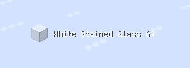

# AntiDeath Survival Assistant
[](https://modrinth.com/mod/Antideath-survival-assistant)
[](https://github.com/jfglzs/Antideath-survival-assistant/releases)

***感谢 @[*OptiJava*](https://github.com/OptiJava) 的指导。***

## 前置模组

| 名称         | 类型 | 链接                                                                                                                     | 备注 |
| ---------- | -- | ---------------------------------------------------------------------------------------------------------------------- | -- |
| malilib    | 必须 | [Sakura 1.21+](https://github.com/sakura-ryoko/malilib) | [Masa 1.21-](https://masa.dy.fi/tmp/minecraft/mods/malilib/) | -  |
| Fabric API | 必须 | [MC百科](https://www.mcmod.cn/class/3124.html) | [官方](https://fabricmc.net/)                                             | -  |

## 支持版本

| Minecraft | 状态   |
| --------- | ---- |
| 1.21.x    | 持续更新 |
| 26.1.x  | 持续更新 |
| 26.2    | 持续更新 |

## 功能

### 苦力怕预警器
当指定范围存在苦力怕时 向玩家发出警报
- 类型：`布尔值`
- 默认值：`true`
- 参考选项：`true`，`false`
- 分类：`ALL`，`FUNCTIONS`

### 苦力怕预警器范围
可调整苦力怕预警器范围
- 类型：`浮点`
- 默认值：`8,0`
- 分类：`ALL`，`FUNCTIONS`

### 打开材料列表时禁用字幕
打开投影的材料列表时自动禁用字幕
- 类型：`布尔值`
- 默认值：`true`
- 参考选项：`true`，`false`
- 分类：`ALL`，`DISABLES`

### 禁用连接超时
在加载超大原理图时禁止connection timed out
- 类型：`布尔值`
- 默认值：`true`
- 参考选项：`true`，`false`
- 分类：`ALL`，`DISABLES`

### 禁用加载地形屏幕
- 类型：`布尔值`
- 默认值：`true`
- 参考选项：`true`，`false`
- 分类：`ALL`，`DISABLES`

### 禁用玩家盔甲渲染
只禁用玩家盔甲渲染 其他实体不受影响
- 类型：`布尔值`
- 默认值：`true`
- 参考选项：`true`，`false`
- 分类：`ALL`，`DISABLES`

### 剩余物品显示overlay
#### 会在屏幕上显示玩家剩余的物品(支持潜影盒)
    


#### 可在设置中调整X/Y偏移


- 类型：`布尔值`
- 默认值：`true`
- 参考选项：`true`，`false`
- 分类：`ALL`，`FUNCTIONS`

### 禁止在地狱门周边放置方块
开启后禁止在地狱门附近放置方块，防止误操作破坏地狱门。
- 类型：`布尔值`
- 默认值：`false`
- 参考选项：`true`，`false`
- 分类：`ALL`，`DISABLES`

### 禁止在地狱门周边放置方块白名单
白名单中的方块不会受到地狱门周边放置限制。
- 类型：`字符串列表`
- 默认值：`[]`
- 分类：`ALL`，`LISTS`

### TAB菜单过滤器
过滤 TAB 菜单中的无用玩家或常驻假人，使列表更加整洁。
- 类型：`布尔值`
- 默认值：`false`
- 参考选项：`true`，`false`
- 分类：`ALL`，`FUNCTIONS`

### TAB菜单过滤器白名单
配置 TAB 菜单过滤器的白名单，仅保留列表中的玩家。
- 类型：`字符串列表`
- 默认值：`[]`
- 分类：`ALL`，`LISTS`

### 启用TAB菜单过滤器白名单
启用后仅显示白名单中的玩家。
- 类型：`布尔值`
- 默认值：`false`
- 参考选项：`true`，`false`
- 分类：`ALL`，`FUNCTIONS`

### TAB菜单过滤器黑名单
配置 TAB 菜单过滤器黑名单，列表中的玩家会被隐藏。
- 类型：`字符串列表`
- 默认值：`[]`
- 分类：`ALL`，`LISTS`

### 启用TAB菜单过滤器前缀
根据玩家名称前缀过滤 TAB 菜单。
- 类型：`布尔值`
- 默认值：`false`
- 参考选项：`true`，`false`
- 分类：`ALL`，`FUNCTIONS`

### TAB菜单过滤器前缀
设置需要过滤的玩家名称前缀。
- 类型：`字符串列表`
- 默认值：`[]`
- 分类：`ALL`，`LISTS`

### 启用材料待取Overlay
启用后，中键点击投影中的方块（背包内没有）会自动加入待取列表。

可在设置中调整 Overlay 的 X/Y 偏移。

- 类型：`布尔值`
- 默认值：`false`
- 参考选项：`true`，`false`
- 分类：`ALL`，`FUNCTIONS`

### 清除材料待取Overlay
清空当前材料待取 Overlay 中的所有待取物品。
- 类型：`快捷键`
- 默认值：`未绑定`
- 分类：`ALL`，`FUNCTIONS`

### 材料待取Overlay-X偏移
调整材料待取 Overlay 在屏幕上的 X 轴偏移。
- 类型：`整数`
- 默认值：`0`
- 分类：`ALL`，`FUNCTIONS`

### 材料待取Overlay-Y偏移
调整材料待取 Overlay 在屏幕上的 Y 轴偏移。
- 类型：`整数`
- 默认值：`0`
- 分类：`ALL`，`FUNCTIONS`

### 打开假人取货菜单
打开假人远程取货菜单。
- 类型：`快捷键`
- 默认值：`未绑定`
- 分类：`ALL`，`LMS`

### 假人远程取货支持
启用假人远程取货功能，需要服务器安装 **LMS Carpet Addition**。
- 类型：`布尔值`
- 默认值：`false`
- 分类：`ALL`，`LMS`

### 右键投影方块取货
右键点击投影方块即可自动向假人请求对应材料。
- 类型：`布尔值`
- 默认值：`false`
- 参考选项：`true`，`false`
- 分类：`ALL`，`LMS`

### 中键投影取货
中键点击投影中的方块时立即取货。

- 普通中键：取 1 组
- Shift + 中键：取 1 盒

需要服务器安装 **LMS Carpet Addition**。

- 类型：`布尔值`
- 默认值：`false`
- 参考选项：`true`，`false`
- 分类：`ALL`，`LMS`

### 假人取货自动打开假人背包
完成取货后自动打开对应假人的背包。
- 类型：`布尔值`
- 默认值：`false`
- 参考选项：`true`，`false`
- 分类：`ALL`，`LMS`

### 假人取货自动打开假人背包交互模式
设置自动打开假人背包的交互方式。

- `true`：使用命令交互
- `false`：使用主手右键交互

- 类型：`布尔值`
- 默认值：`false`
- 分类：`ALL`，`LMS`

### 假人远程取货自动下线假人
完成取货后自动让假人下线。
- 类型：`布尔值`
- 默认值：`false`
- 参考选项：`true`，`false`
- 分类：`ALL`，`LMS`

### 假人远程取货自动打开背包/自动下线延迟
设置自动打开背包及自动下线的等待时间。
- 类型：`整数`
- 默认值：`100`
- 单位：`ms`
- 分类：`ALL`，`LMS`

### 防止被刻意的游戏设计杀死
自动阻止因“刻意的游戏设计”造成的死亡，例如被踢出的恶意数据包等特殊情况。
- 类型：`布尔值`
- 默认值：`false`
- 参考选项：`true`，`false`
- 分类：`ALL`，`DISABLES`

### 禁用TAB菜单背景
隐藏 TAB 玩家列表的背景，仅保留玩家列表内容。
- 类型：`布尔值`
- 默认值：`false`
- 参考选项：`true`，`false`
- 分类：`ALL`，`DISABLES`

### 触发假人杀戮光环
触发一次假人杀戮光环，对符合条件的假人执行攻击。
- 类型：`快捷键`
- 默认值：`未绑定`
- 分类：`ALL`，`FUNCTIONS`

### 假人杀戮光环前缀
设置参与杀戮光环的假人名称前缀。
- 类型：`字符串`
- 默认值：`bot_`
- 分类：`ALL`，`FUNCTIONS`

### 假人杀戮光环范围
设置杀戮光环的检测范围，以玩家为中心。
- 类型：`浮点`
- 默认值：`4.0`
- 分类：`ALL`，`FUNCTIONS`

### 启用假人杀戮光环黑名单
启用假人杀戮光环黑名单，仅对黑名单中的假人生效。
- 类型：`布尔值`
- 默认值：`false`
- 参考选项：`true`，`false`
- 分类：`ALL`，`FUNCTIONS`

### 假人杀戮光环黑名单
配置假人杀戮光环黑名单，仅对列表中的假人生效，精确匹配且忽略大小写。
- 类型：`字符串列表`
- 默认值：`[]`
- 分类：`ALL`，`LISTS`

### 启用假人杀戮光环白名单
启用假人杀戮光环白名单，仅对白名单中的假人生效。
- 类型：`布尔值`
- 默认值：`false`
- 参考选项：`true`，`false`
- 分类：`ALL`，`FUNCTIONS`

### 假人杀戮光环白名单
配置假人杀戮光环白名单，仅对列表中的假人生效，精确匹配且忽略大小写。
- 类型：`字符串列表`
- 默认值：`[]`
- 分类：`ALL`，`LISTS`

### 低生命值自动执行命令/发送聊天消息
当生命值低于设定阈值时，自动执行命令或发送聊天消息。
- 类型：`布尔值`
- 默认值：`false`
- 参考选项：`true`，`false`
- 分类：`ALL`，`FUNCTIONS`

### 生命值阈值
设置触发自动执行命令或发送消息的生命值。
- 类型：`浮点`
- 默认值：`4.0`
- 分类：`ALL`，`FUNCTIONS`

### 发送模式
设置低生命值后的触发方式。
- 类型：`选项`
- 默认值：`发送聊天消息`
- 分类：`ALL`，`FUNCTIONS`

### 发送内容
设置低生命值时发送的聊天内容或执行的命令。

发送模式为命令时，可直接填写命令（无需输入 `/`）。

- 类型：`字符串`
- 默认值：`!s`
- 分类：`ALL`，`FUNCTIONS`

### MiniHud掉帧优化
优化 MiniHud 部分渲染逻辑，降低掉帧情况。
- 类型：`布尔值`
- 默认值：`false`
- 参考选项：`true`，`false`
- 分类：`ALL`，`FUNCTIONS`

### 强制方块挖掘冷却
移植自 OMMC 的功能，强制遵循原版方块挖掘冷却。
- 类型：`布尔值`
- 默认值：`false`
- 参考选项：`true`，`false`
- 分类：`ALL`，`FUNCTIONS`

### 平坦挖掘
移植自 OMMC 的平坦挖掘功能，仅破坏与目标方块同一平面的方块。
- 类型：`布尔值`
- 默认值：`false`
- 参考选项：`true`，`false`
- 分类：`ALL`，`FUNCTIONS`

### 透明展示框
使展示框模型透明，仅保留展示物品。

需要关闭 MoreCulling 的自定义展示框渲染器才能正常工作。

- 类型：`布尔值`
- 默认值：`false`
- 参考选项：`true`，`false`
- 分类：`ALL`，`DISABLES`

### 禁用掉落物旋转
禁用掉落物实体的旋转动画。
- 类型：`布尔值`
- 默认值：`false`
- 参考选项：`true`，`false`
- 分类：`ALL`，`DISABLES`

### 禁用字幕背景
隐藏字幕背景，仅显示字幕文本。
- 类型：`布尔值`
- 默认值：`false`
- 参考选项：`true`，`false`
- 分类：`ALL`，`DISABLES`

### 随时可以断开连接
为连接界面和重连界面增加退出按钮，可在任何时候主动断开连接。
- 类型：`布尔值`
- 默认值：`false`
- 参考选项：`true`，`false`
- 分类：`ALL`，`FUNCTIONS`

### 禁用容器背景渲染
打开容器时不渲染背景，提高界面透明度。
- 类型：`布尔值`
- 默认值：`false`
- 参考选项：`true`，`false`
- 分类：`ALL`，`DISABLES`

### /pm 命令
启用 `/pm` 命令，用于批量操作假人。

支持以下格式：

```text
/pm <前缀> <开始值> <结束值> <Action>
/pm <开始值> <结束值> <Action>
```

- 类型：`布尔值`
- 默认值：`false`
- 参考选项：`true`，`false`
- 分类：`ALL`，`COMMAND`

### /pm 命令执行冷却
设置 `/pm` 命令连续执行 Action 时的等待时间。
- 类型：`整数`
- 默认值：`10`
- 单位：`ms`
- 分类：`ALL`，`COMMAND`

### /pm 命令默认前缀
设置 `/pm` 命令默认使用的假人名称前缀。
- 类型：`字符串`
- 默认值：`bot_`
- 分类：`ALL`，`COMMAND`

### 聊天消息映射
将指定聊天消息自动映射为命令执行。

例如发送 `!s` 自动执行 `/spectator`。

- 类型：`布尔值`
- 默认值：`false`
- 参考选项：`true`，`false`
- 分类：`ALL`，`FUNCTIONS`

### 聊天消息映射列表
配置聊天消息与命令的映射关系。

格式：

```text
!s=spectator
```

- 类型：`字符串列表`
- 默认值：`[]`
- 分类：`ALL`，`LISTS`

### 启用自动垃圾清理
自动识别并清理背包中的垃圾物品。
- 类型：`布尔值`
- 默认值：`false`
- 参考选项：`true`，`false`
- 分类：`ALL`，`FUNCTIONS`

### 自动垃圾清理-切换模式
切换自动垃圾清理模式。
- 类型：`快捷键`
- 默认值：`未绑定`
- 分类：`ALL`，`FUNCTIONS`

### 自动垃圾清理-清理模式
设置垃圾物品的处理方式。
- 类型：`选项`
- 分类：`ALL`，`FUNCTIONS`

### 自动垃圾清理-保存背包物品
将当前背包物品快速保存至白名单或黑名单。
- 类型：`快捷键`
- 默认值：`未绑定`
- 分类：`ALL`，`FUNCTIONS`

### 启用自动垃圾清理白名单
启用自动垃圾清理白名单。
- 类型：`布尔值`
- 默认值：`false`
- 参考选项：`true`，`false`
- 分类：`ALL`，`FUNCTIONS`

### 自动垃圾清理白名单
白名单中的物品不会被清理。
- 类型：`字符串列表`
- 默认值：`[]`
- 分类：`ALL`，`LISTS`

### 启用自动垃圾清理黑名单
启用自动垃圾清理黑名单。
- 类型：`布尔值`
- 默认值：`false`
- 参考选项：`true`，`false`
- 分类：`ALL`，`FUNCTIONS`

### 自动垃圾清理黑名单
黑名单中的物品会优先被清理。
- 类型：`字符串列表`
- 默认值：`[]`
- 分类：`ALL`，`LISTS`

### 挂载Logger信息到MiniHud
将 Logger 输出的信息显示到 MiniHud Overlay 中。
- 类型：`布尔值`
- 默认值：`false`
- 参考选项：`true`，`false`
- 分类：`ALL`，`FUNCTIONS`

### 启用挂载Logger信息到MiniHud白名单
启用 Logger 信息白名单过滤。
- 类型：`布尔值`
- 默认值：`false`
- 参考选项：`true`，`false`
- 分类：`ALL`，`FUNCTIONS`

### 挂载Logger信息到MiniHud白名单
仅显示名称包含白名单关键字的 Logger。
- 类型：`字符串列表`
- 默认值：`[]`
- 分类：`ALL`，`FUNCTIONS`

### 启用挂载Logger信息到MiniHud黑名单
启用 Logger 信息黑名单过滤。
- 类型：`布尔值`
- 默认值：`false`
- 参考选项：`true`，`false`
- 分类：`ALL`，`FUNCTIONS`

### 挂载Logger信息到MiniHud黑名单
隐藏名称包含黑名单关键字的 Logger。
- 类型：`字符串列表`
- 默认值：`[]`
- 分类：`ALL`，`FUNCTIONS`

### 可在游戏中打开多人游戏菜单
无需退出世界即可打开多人游戏菜单。
- 类型：`布尔值`
- 默认值：`false`
- 参考选项：`true`，`false`
- 分类：`ALL`，`FUNCTIONS`

### 启用自定义方块碰撞箱
允许自定义指定方块的碰撞箱。
- 类型：`布尔值`
- 默认值：`false`
- 参考选项：`true`，`false`
- 分类：`ALL`，`FUNCTIONS`

### 启用自定义方块碰撞箱白名单
启用自定义方块碰撞箱白名单。
- 类型：`布尔值`
- 默认值：`false`
- 参考选项：`true`，`false`
- 分类：`ALL`，`FUNCTIONS`

### 自定义方块碰撞箱白名单
白名单中的方块会使用自定义碰撞箱。
- 类型：`字符串列表`
- 默认值：`[]`
- 分类：`ALL`，`LISTS`

### 启用自定义方块碰撞箱黑名单
启用自定义方块碰撞箱黑名单。
- 类型：`布尔值`
- 默认值：`false`
- 参考选项：`true`，`false`
- 分类：`ALL`，`FUNCTIONS`

### 自定义方块碰撞箱黑名单
黑名单中的方块不会使用自定义碰撞箱。
- 类型：`字符串列表`
- 默认值：`[]`
- 分类：`ALL`，`LISTS`

### 启用自定义投影方块替换
允许将投影中的方块替换为指定方块进行显示。
- 类型：`布尔值`
- 默认值：`false`
- 参考选项：`true`，`false`
- 分类：`ALL`，`FUNCTIONS`

### 自定义投影方块替换
配置投影方块替换规则。

格式：

```text
minecraft:item|minecraft:item1
```

表示将左侧方块替换为右侧方块显示。

- 类型：`字符串列表`
- 默认值：`[]`
- 分类：`ALL`，`LISTS`

### 启用自动盒子补货
自动从潜影盒补充背包物品。

需要开启 Tweakeroo 的自动补货功能。

- 类型：`布尔值`
- 默认值：`false`
- 参考选项：`true`，`false`
- 分类：`ALL`，`FUNCTIONS`

### 启用自动盒子补货白名单
启用自动盒子补货白名单。
- 类型：`布尔值`
- 默认值：`false`
- 参考选项：`true`，`false`
- 分类：`ALL`，`FUNCTIONS`

### 自动盒子补货白名单
仅对白名单中的物品进行自动补货。
- 类型：`字符串列表`
- 默认值：`[]`
- 分类：`ALL`，`LISTS`

### 启用自动盒子补货黑名单
启用自动盒子补货黑名单。
- 类型：`布尔值`
- 默认值：`false`
- 参考选项：`true`，`false`
- 分类：`ALL`，`FUNCTIONS`

### 自动盒子补货黑名单
黑名单中的物品不会自动补货。
- 类型：`字符串列表`
- 默认值：`[]`
- 分类：`ALL`，`LISTS`

### 禁用确认执行屏幕（1.21.10+）
跳过原版确认执行界面。
- 类型：`布尔值`
- 默认值：`false`
- 参考选项：`true`，`false`
- 分类：`ALL`，`DISABLES`

### 禁用数据包踢出
阻止因数据包解析错误而被服务器踢出。

建议搭配 ViaFabricPlus 使用。

- 类型：`布尔值`
- 默认值：`false`
- 参考选项：`true`，`false`
- 分类：`ALL`，`DISABLES`

### 禁用Profiler
禁用客户端 Profiler。

可提升部分帧率，但调试饼图将无法使用。

- 类型：`布尔值`
- 默认值：`false`
- 参考选项：`true`，`false`
- 分类：`ALL`，`DISABLES`，`OPTIMIZATIONS`

### 客户端实体Tick优化
优化客户端实体 Tick 逻辑，减少无效计算，提高流畅度。
- 类型：`布尔值`
- 默认值：`false`
- 参考选项：`true`，`false`
- 分类：`ALL`，`OPTIMIZATIONS`

### 自动宝库命令（/autovault）
提供 `/autovault` 命令，用于自动操作宝库。

支持自动生成假人、定位宝库以及自动开启宝库。

- 类型：`布尔值`
- 默认值：`false`
- 参考选项：`true`，`false`
- 分类：`ALL`，`COMMAND`

### 触发潜影盒物品分离器
按下快捷键后保存主手物品，并自动打开背包（除快捷栏外）的所有潜影盒，将符合条件的物品自动分离出来。
- 类型：`快捷键`
- 默认值：`未绑定`
- 分类：`ALL`，`FUNCTIONS`

### 假人背包物品缓存
缓存假人背包中的物品。

中键投影取货时会优先从缓存中寻找对应物品，提高取货效率。

- 类型：`布尔值`
- 默认值：`false`
- 参考选项：`true`，`false`
- 分类：`ALL`，`LMS`

### 假人背包物品缓存-假人白名单
仅缓存白名单中的假人背包。
- 类型：`字符串列表`
- 默认值：`[]`
- 分类：`ALL`，`LISTS`

### 假人背包物品缓存-清理缓存
清除所有已缓存的假人背包数据。
- 类型：`快捷键`
- 默认值：`未绑定`
- 分类：`ALL`，`LMS`

### 投影材料列表-统计全物品
统计材料列表时，同时统计完整物品（包括潜影盒内物品）。
- 类型：`布尔值`
- 默认值：`false`
- 参考选项：`true`，`false`
- 分类：`ALL`，`LMS`

### 投影材料列表-统计假人背包
统计材料列表时，同时统计已缓存的假人背包物品。
- 类型：`布尔值`
- 默认值：`false`
- 参考选项：`true`，`false`
- 分类：`ALL`，`LMS`